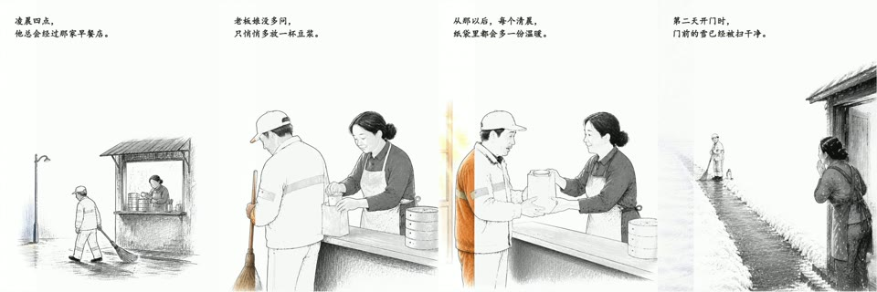

# Handdraw Story Video

把 7–9 幅手绘故事母图制作成 35–45 秒竖屏短视频：先从左到右显现黑白线稿，再沿相同方向逐步填入低饱和色彩。项目包含故事配置校验、线稿提取、HyperFrames 页面生成，以及可安装的 Codex Skill。



新手直接看：[中文使用方法](docs/usage.md) · [生图模型接入](docs/image-generation.md) · [固定画风提示词](docs/prompts.md)

想直接按主题批量生成：[一键成片配置](config.example.json)

## 特点

- 默认 40 秒、720×960、30 fps，适合竖屏平台
- 每幕使用一张独立彩色母图，本地提取完全对齐的线稿
- 线稿和颜色统一从左向右推进，不重复调用生图模型
- 支持可选故事字幕和画面内道具文字
- 自动检查时长、重复素材、字幕行数与字号范围
- 不绑定生图服务、音乐来源或私有 API

## 环境要求

- Python 3.10+
- Node.js 18+
- FFmpeg
- [HyperFrames](https://www.npmjs.com/package/hyperframes)
- GSAP 3（通过 npm 安装，遵守其许可条款）

## 快速开始

```bash
git clone https://github.com/xiejunjie524/handdraw-story-video.git
cd handdraw-story-video
python -m venv .venv
# Windows: .venv\Scripts\activate
# macOS/Linux: source .venv/bin/activate
pip install -r requirements.txt
npm install gsap
```

1. 复制模板并填写故事：

```bash
cp templates/story-template.json story.json
```

2. 每幕只生成一张 1K 彩色母图，再提取对齐线稿：

```bash
python scripts/make_lineart.py assets/images/scene-01-color.png assets/images/scene-01-line.png
```

3. 准备 HyperFrames 目录和 GSAP：

```bash
mkdir -p hyperframes/assets/vendor
cp node_modules/gsap/dist/gsap.min.js hyperframes/assets/vendor/gsap.min.js
```

Windows PowerShell 可使用：

```powershell
New-Item -ItemType Directory -Force hyperframes/assets/vendor | Out-Null
Copy-Item node_modules/gsap/dist/gsap.min.js hyperframes/assets/vendor/gsap.min.js
```

4. 把图片和已获授权的 BGM 放到 `hyperframes/assets/`，确保路径与 `story.json` 一致，然后生成页面：

```bash
python scripts/build_story.py story.json hyperframes/index.html --check-assets
npx hyperframes check hyperframes/index.html --json
npx hyperframes render hyperframes/index.html --output renders/story-v1.mp4 --workers 1
```

不要覆盖旧成片；每次使用新的输出文件名。

## 故事配置

最小场景结构：

```json
{
  "id": "scene-1",
  "duration": 5,
  "caption_lines": ["凌晨四点，", "他总会经过那家早餐店。"],
  "line_image": "assets/images/scene-01-line.png",
  "color_image": "assets/images/scene-01-color.png",
  "crop": {"scale": 1, "x": 0, "y": 0}
}
```

完整字段和分镜规则见 [docs/story-spec.md](docs/story-spec.md)，可运行示例见 [examples/soy-milk-at-4am/story.json](examples/soy-milk-at-4am/story.json)。

## 画面原则

- 8 幕通常各约 5 秒，每幕必须是不同构图，不能靠裁切或缩放凑时长。
- 主体通常位于画面下方 45%–55%，保留大面积纸白留白。
- 单帧最多 2–3 人、两个关键背景锚点，避免人群、密集建筑和大块黑线。
- 字幕最多 3 行，每行不超过约 18 个中文字符。
- 音乐按故事选择，不把某一首 BGM 固定进模板。

## Codex Skill

仓库根目录本身符合 Codex Skill 结构。可将仓库复制或链接到 `$CODEX_HOME/skills/handdraw-good-deed-story`，然后用类似“做一个 40 秒线稿逐渐上色的暖心故事”触发。

## 素材与许可

代码以 MIT 许可发布。生成图片、字体、GSAP、音乐及其他第三方素材不自动获得 MIT 授权，使用者须遵守各自提供方和素材来源的条款。仓库不包含 API 密钥、浏览器会话、参考视频、下载音乐或完整渲染历史。
